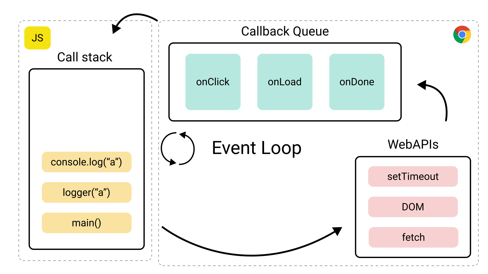

# Asynchronous Control Flow

## Today's menu

- Functions recap
- Callbacks recap
- What does 'asynchronous' mean?
- Playing with setTimeout
- Playing with the filesystem
- Playing with standard IO

## Recap - Higher Order Functions

### Three different styles of writing functions

```js
function functionDeclaration() {} // Avoid this due to gotchas with hoisting/redefining

const functionExpression = function () {};

const arrowFunctionExpression = () => {}; // Typically used for defining (anonymous) callbacks

// For single-line arrow functions, we can omit the curly braces to return the expression, i.e.
const add = (a, b) => {
  return a + b;
}; // is the same as
const add = (a, b) => a + b;
```

### Functions as first-class objects (or first-class citizens)

- In JS, a function can be treated like any other variable. It can assigned to a variable, be passed as arguments to other functions (i.e. callbacks), or even returned by another function.
- A higher-order function is a function that takes a function as an argument (or return another function).
  - Using string/number as arguments allow us to be flexible about the data we give to a function
  - Using a function as an argument allows us to be flexible about what we **DO** with the data

## Recap - Callback function

- A callback function is usually being passed as an argument to another function for mainly 2 purposes:

  1. For flexibility, we want "what to do" to be determined by the user
  2. Used for asynchronous processes so we can tell the function "what to do" after the process has finished

- Example for #1: a self-made map function, where we want to **do** the same thing for every element of an array

```js
const map = (list, whatWeWantToDoToEachElement) => {
  const outputArr = [];

  for (const element of list) {
    outputArr.push(whatWeWantToDoToEachElement(element));
  }

  return outputArr;
};

// Usage
const array = [1, 2, 3];
const doubleIt = (number) => number * 2; // The callback function we are passing into `map`
map(array, doubleIt); // Returns [2, 4, 6]
```

## Asynchronous JS

What is Asynchronous JS?

- We are used to synchronous JS which performs tasks sequentially from the top to the bottom of the file, line by line

  - Things are more simple with synchronous code.
  - The drawback to running things strictly in sequence is _performance_.

- JavaScript runs in a single thread

  - It has a single call stack.
  - It can only do one thing at a time.
  - Therefore, doing something that normally takes a long time (reading a large file, database operations, fetching data from the web, etc) synchronously will **block the main code execution** for some time.
  - It can cause problems with highly interactive UI.

- Asynchronous Javascript allows for longer-running tasks to be performed **without blocking** the main code execution.

- However, dealing with async code makes things a bit trickier since tasks are not performed from top to bottom as we are used to.

## Async Control Flow

- setTimeout allows us to run a function once after a set amount of time (in ms)

```js
// syntax
setTimeout(callback, delay_in_ms);
```

- In what order will the console.logs execute?

```js
console.log("BEFORE CALL");

setTimeout(() => {
  console.log("INSIDE CALL");
}, 1000);

console.log("AFTER CALL");
```

- What will each console.log output?

```js
let x = 1;
console.log("BEFORE CALL: ", x);

setTimeout(() => {
  x = 2;
  console.log("INSIDE CALL: ", x);
}, 1000);

console.log("AFTER CALL", x);
```

```js
const updateUsername = (callback) => {
  const data = { username: "Bob" };

  console.log("BEFORE TIMEOUT CALL");
  setTimeout(() => {
    data.username = "SpongeBob";
    callback();
    // what if we return data below? Like so:
    // return data;
  });

  console.log("AFTER TIMEOUT CALL");
  // okay, if not in the setTimeout callback above, what if we return data here? So that result below is set to the data. Like so:
  // return data;
};

console.log("BEFORE MAIN CALL");
const result = updateUsername(() => {
  console.log("INSIDE CALLBACK");
});
console.log({ result });
console.log("AFTER MAIN CALL");
```

## Event loop



- Javascript has two queues that executes our line-by-line code - all our code gets put into one of the two queues
  1. The main "call stack" (pretty much every language has this) is where synchronous code gets executed
  2. The "callback" queue is where some functions can put their callback code to be executed later
  - Only some functions are able to do this (Web/nodejs APIs, we will write our functions own later). They include:
    1. setTimeout: execute callback after a set amount of time
    2. fs.readFile: execute callback after file has been read
    3. readline.question: execute callback after user has provided inputted
  3. ***The main call stack must be completely empty/finished before code in the callback queue gets executed!***

## Examples with fs module

- [Reading with readFile (async)](./4-fileSystemDemo.js)

## User Input

- [stdin Example](./6-stdinStdoutDemo.js)

* Events are actions or occurrences that happen in the system you are programming, which the system tells you about so you can respond to them in some way if desired.

* The system will fire a signal of some kind when an event occurs, and also provide a mechanism by which some kind of action can be automatically taken (e.g. some code running) when the event occurs.

* We don't know when these events are occuring, so we need an asynchronous control flow.

  - An **Event Handler** is a callback function that will be called when an event is triggered.

  - The event loop listens for event triggers and calls the associated event handler for that event.

## Useful links
- [nodejs documentation (for `fs`, `readline`)](https://nodejs.org/docs/latest-v14.x/api/fs.html)
