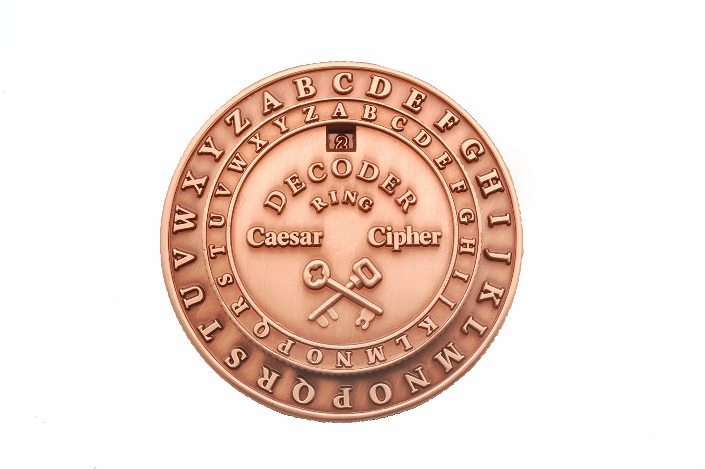
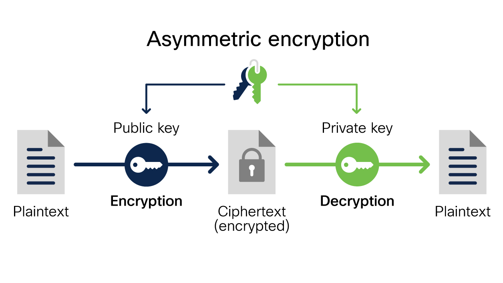
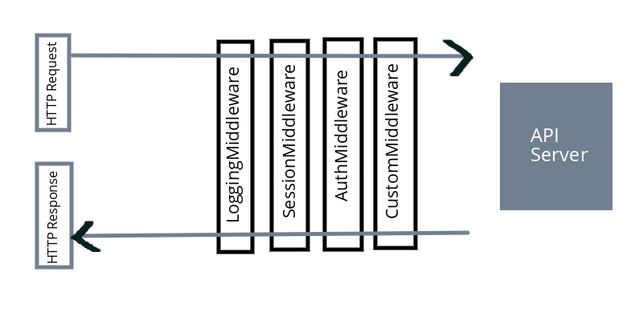

# Security and Real World HTTP Servers

## Today's menu

- [x] Review the Express framework and cookies by building a secret-keeping app
- [x] Talk about encryption (Caesar cipher)
- [x] Encrypt our cookies for the secret-keeping app
- [x] Hash our users' passwords so they will be safe in case of a password leak
- [ ] Talk about middlewares and create our own middleware to handle authentication

## Encryption

- A way to turn meaningful data into a bunch of gibberish to protect it from nefarious people, which can then be turned back into data if you know the encryption "key"
- One of the earliest methods of encryption was used by Julius Caesar to relay military commands, called the [Caesar Cipher](https://en.wikipedia.org/wiki/Caesar_cipher)
  - By shifting each alphabet in our message forward x times, we can create an encoded message. For example, shifting it +3 (the secret key) turns the string `ATTACK` into `DWWDFN`
  - The encryption key in this case is "shift it forward by 3"
  - This rotary tool was used back then and makes it easy to do the alphabet shifting
    
- Modern encryption methods are less simple and involve a lot more math
- By encrypting our cookies with a secret key that only the server knows, we can store cookies on users' browsers and feel safe knowing they can't modify their cookies to impersonate another user etc.
  - However, we don't need to encrypt some cookies that users are supposed to change and present no security risk, such as language preferences

## Hashing

- Unlike encryption, hashing turns meaningful data into gibberish (hashed data) that can never be turned back into meaningful data
- The same data will always produce the same gibberish for a given hashing method
- By hashing our user's passwords and storing this hash during registration, the next time they login we can hash the password they entered and compare this hash with the previous one
  - In case of a password breach, the hackers won't know the actual password but only the password hashes, and as we said it's impossible to get the original data from its hash
- `bcrypt` is the hashing function we use for TinyApp
  - One of its strengths is you can specify how computationally-intensive you want the hashing function to be
  - It also uses "salt", which is a non-secret random string added to the password (and stored alongside the password hash in the db) before hashing it
    - This prevents hackers from using pre-computed tables of (common) passwords and their hashes to figure out the password from a hash

## Asymmetric encryption (a.k.a. public-key cryptography)

- So far the encryption we talked about is called symmetric encryption, where a single key is used for both encrypting and decrypting data
- Unlike symmetric encryption which has been around for millenia, asymmetric encryption was first developed in 1970s
- The breakthrough was coming up with an algorithm (i.e. RSA) that generates a pair of keys, where one key in the pair (private key) can decode the message that is encoded by the other key (public key)
  - Even though the private and public keys are a set, it is impossible to derive the private key from the public key, as with password hashing. Unlike passwords, the private key is never transmitted.
- Conceptually, this means that I can now generate a key pair and freely give everyone my public key, and everyone can send me an encrypted message knowing for sure that only I can decrypt it
  - In this way, my public key acts as a very secure ID - you can make me prove that I "own" the public key by encrypting a message with it and asking me to decode it
  - This small detail enables modern-day secure communication over the internet, such as:
    - SSH - we pasted our public key on github, and now every time we push to github our computer uses the private key to respond to github's challenge and prove we are the owners of the public key
      - We were also prompted to trust github.com's public key when we connected to them for the first time, and stored their public key in our `.ssh/known_hosts` file
    - HTTPS (TLS) - the client and server use asymmetric encryption to securely share a symmetric encryption key, which is then used to encrypt the request and response and prevent "man-in-the-middle" attacks. An important part in HTTPS is that the server's public key is registered with a Certificate Authority which vouches that the owner of the server's public key is indeed the person/company that owns the server.

## Middleware

- Middlewares are pieces of code that processes the request received by our users before (and after) it hits our "main code" (i.e. our `app.get`, `app.post` routes)
  - Common uses are to "parse" the raw request into something nicer, such as:
    - Doing url-decoding (e.g. spaces are url-encoded as `%20`) so we don't need to do it in our main code
    - Parsing the cookies from the request header so we can simply write `req.session.cookie_name` in our main code
  - Other uses are for logging, where the details of every request is stored, for things like:
    - Consumer analytics - how many visits does each page get?
    - Troubleshooting/monitoring - we can use a single piece of code to log all the errors that occurs anywhere in our application
    - Performance tuning our server - we can start and stop a timer around our main code to measure how fast our server is and make improvements
- Usually multiple middlewares are chained and all get their turn to perform their action before the main code. The order of the middleware matters a lot and it's conceptually similar to a call stack.
- In `express`, we register a middleware using `app.use`.
  - If we are making our own middleware function, we call `next()` to pass the request to the next middleware in the chain.
